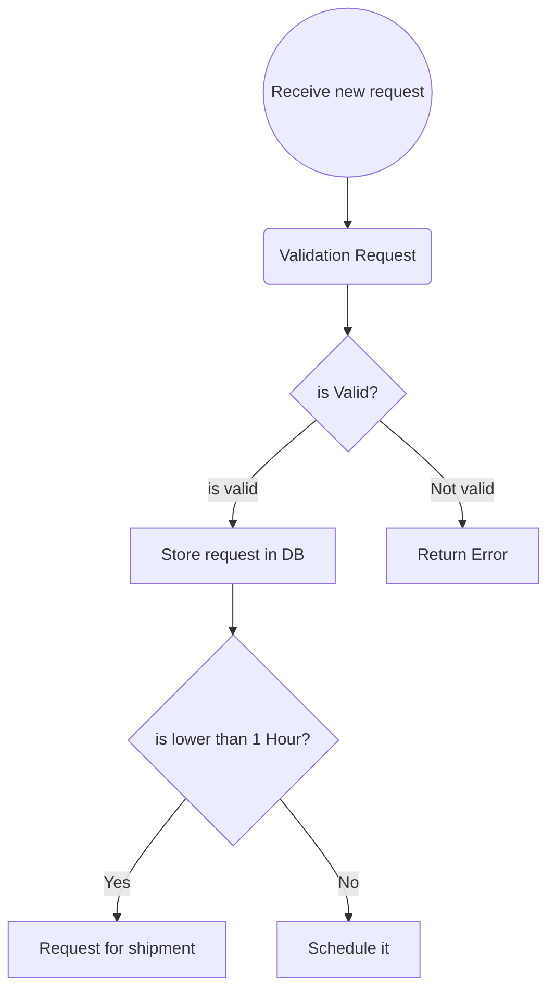
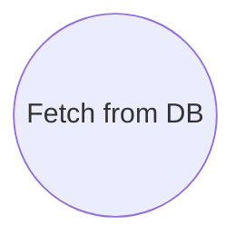
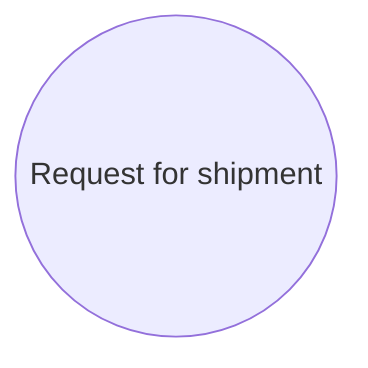
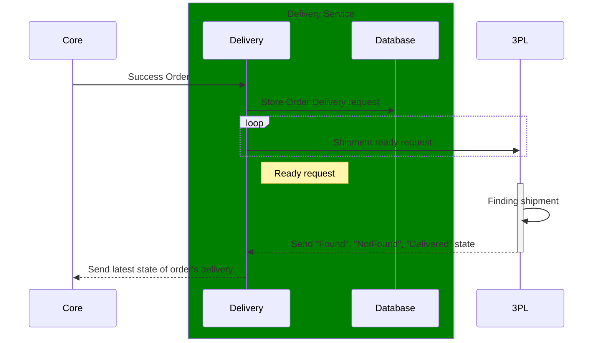

# Delivery Service:
## Responsibility:
1. Integration of 3PLs
2. Requesting couriers for shipments from a specific origin to a destination within a selected time frame
3. Management and updating of courier and request statuses

## Receive new request:

## Fetch schedule requests:

## Proces requests:

# User Story:
## Requirements:
Request for shipment model:
| Field    | type |
| -------- | ------- |
| OrderId  | unique    |
| UserInfo | UserInfo     |
| fromLoc  | [lat,lng]    |
| toLoc    | [lat, lng] |
| delveryTimeFrame | [from, to] |

Time Frame: Two-hour time slots from 9 AM to 11 PM (for the next 4 days)

### Delivery State
    1. init
    2. isFinding
    3. found
    4. notFound
    5. delivered

## Schedule Rules:
1. Request for shipment if time to delivery is <= 1 Hour OR is >= 15' from init state.

## Delivery Acceptance 
1. Process 10,000 Requests in 1 Hour
2. Scalability
3. Seeder for generate orders in difference time
4. Find the shipment after maximum 3 retries.
5. 95% Success (or uptime)
6. Core get 5% fault for get state.
7. 3PL has 5% fault 

