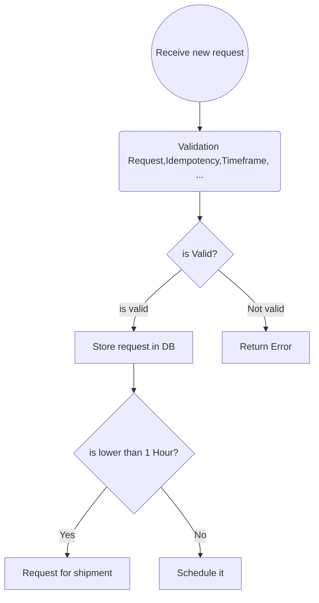
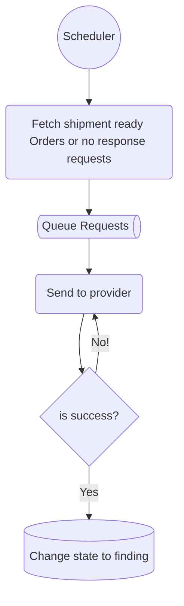
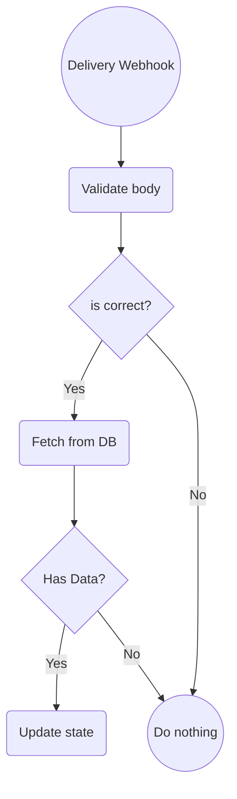
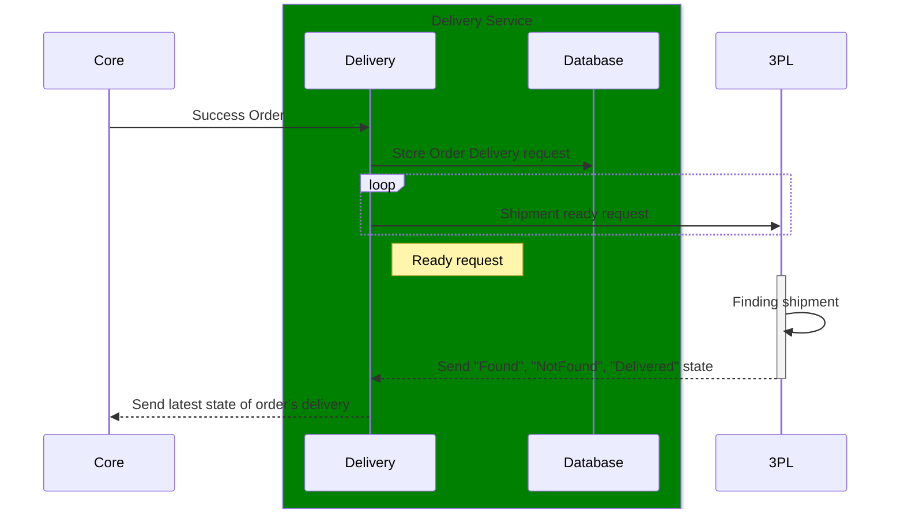

# Delivery Service:
## Responsibility:
1. Integration of 3PLs
2. Requesting couriers for shipments from a specific origin to a destination within a selected time frame
3. Management and updating of courier and request statuses

## TODO:
- [ ] Project directory structure
- [x] Database Design
- [ ] 3PL Proxy Pattern
- [ ] Webhook and API Design
- [ ] Database Migration
- [ ] Entity and Repositories
- [ ] Services
- [ ] Controller
- [ ] Test and Mock
- [x] Scheduler
- [ ] Documentation
- [ ] Request Validation and Idempotency
- [ ] Log

## Receive new request:


## Fetch schedule requests:


## Proces requests:


# Database
```dbdiagram
Enum "order_status" {
  "created"
  "in_progress"
  "completed"
  "canceled"
}

Table "orders" {
  "id" SERIAL [pk, increment]
  "order_number" VARCHAR(255) [unique, not null]
  "status" order_status [not null]
  "user_info" JSON [not null]
  "origin_latitude" DOUBLEPRECISION [not null]
  "origin_longitude" DOUBLEPRECISION [not null]
  "destination_latitude" DOUBLEPRECISION [not null]
  "destination_longitude" DOUBLEPRECISION [not null]
  "time_frame_days" INT [not null]
  "time_frame_from" TIMESTAMP [not null]
  "time_frame_to" TIMESTAMP [not null]
  "created_at" TIMESTAMP [not null, default: `CURRENT_TIMESTAMP`]
  "updated_at" TIMESTAMP
}

Enum "delivery_status" {
  "init"
  "finding"
  "found"
  "not_found"
  "delivered"
  "canceled"
}

Table "deliveries" {
  "id" SERIAL [pk, increment]
  "order_id" BIGINT [not null]
  "provider" VARCHAR(255) [not null]
  "origin_latitude" DOUBLEPRECISION [not null]
  "origin_longitude" DOUBLEPRECISION [not null]
  "destination_latitude" DOUBLEPRECISION [not null]
  "destination_longitude" DOUBLEPRECISION [not null]
  "time_frame_start" TIMESTAMP [not null]
  "time_frame_end" TIMESTAMP [not null]
  "status" delivery_status [not null]
  "created_at" TIMESTAMP [not null, default: `CURRENT_TIMESTAMP`]
  "updated_at" TIMESTAMP
}

Table "delivery_audits" {
  "id" SERIAL [pk, increment]
  "delivery_id" BIGINT [not null]
  "provider" VARCHAR(255) [not null]
  "status" delivery_status [not null]
  "created_at" TIMESTAMP [not null, default: `CURRENT_TIMESTAMP`]
}

Table providers {
  id SERIAL [pk, increment]
  "name" varchar(255)
  is_enable bool
  priority int
}
```

# User Story:
## Requirements:
Request for shipment model:
| Field    | type |
| -------- | ------- |
| OrderId  | unique    |
| UserInfo | UserInfo     |
| fromLoc  | [lat,lng]    |
| toLoc    | [lat,lng] |
| delveryTimeFrame | Timeframe |

Time Frame: Two-hour time slots from 9 AM to 11 PM (for the next 4 days)


### Delivery State
    1. init
    2. isFinding
    3. found
    4. notFound
    5. delivered



## Schedule Rules:
1. Request for shipment if time to delivery is <= 1 Hour OR is >= 15' from init state.

## Delivery Acceptance 
1. Process 10,000 Requests in 1 Hour
2. Scalability
3. Seeder for generate orders in difference time
4. Find the shipment after maximum 3 retries.
5. 95% Success (or uptime)
6. Core get 5% fault for get state.
7. 3PL has 5% fault 

